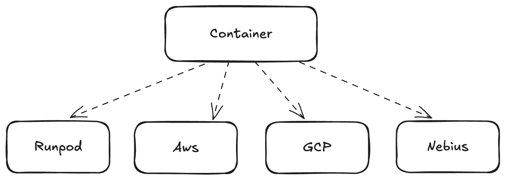

<p align="center">
  
</p>


__A globally distributed container orchestrator__

Think of it as a Kubernetes that can span clouds and regions with a focus on __accelerated compute__.    
Ships as a single binary, performant and lightweight via Rust :crab:    
   
Why not Kubernetes? See [why_not_kube.md](docs/why_not_kube.md)   
   
> [!WARNING]
> Nebulous is in __alpha__, things may break.

## Concepts

### Cross-cloud Autoscaling

Nebulous helps find accelerators wherever they may be, across clouds or in your datacenter. It scales those resources as needed based on usage.
<div align="center">

</div>

### Globally Segmented Networks

Nebulous connects resources across clouds using [Tailnet](https://tailscale.com/kb/1136/tailnet). Every container deployed is connected to every other container in their segmented namespace regardless of where they are running.

### Decentralized Data Layer

Nebulous enables fast and resiliant replication of data between nodes using [Iroh](https://www.iroh.computer/) a p2p daemon. Containers can subscribe to data resources in their namespace and have them lazily synced from peers as they need them regardless of geolocation.


### Suspendable

Nebulous enables containers to be suspended and restored at any point in time, including GPU operations. This enables forking of containers in realtime or migrating workloads seemlessly to cheaper resources.


### Billable

Accelerated resources are expensive. Nebulous comes batteries-included with primitives for consumption based billing using [OpenMeter](https://github.com/openmeterio/openmeter).


### Multi-tentant

Nebulous is multi-tenant from the ground up, providing strong isolation of workloads and robust authorization mechanisms.


### Lightweight

Everything in Nebulous is built to be light as a feather, it should feel the opposite of Kubernetes. You can spin it up easily on your local machine as a single process, while still enabling you to seemlessly scale to thousands of nodes in the cloud when needed.

Nebulous should be as cheap as possible when not in use.

## Installation

```sh
curl -fsSL -H "Cache-Control: no-cache" https://raw.githubusercontent.com/agentsea/neblous/main/remote_install.sh | bash
```
> [!NOTE]
> Only MacOS and Linux arm64/amd64 are supported at this time.

## Usage   

Export the keys of your cloud providers.
```sh
export RUNPOD_API_KEY=...
export AWS_ACCESS_KEY_ID=...
export AWS_SECRET_ACCESS_KEY=...
```

Run a local API server on docker
```sh
neb serve --docker
```

Or optionally run on Kubernetes with our [helm chart](./deploy/charts/neblous/)   
   
Connect to the tailnet
```sh
neb connect
```
    
See what cloud platforms are currently supported.
```sh
neb get platforms
```

> [!TIP]
> Prefer a pythonic interface? Try [neblous-py](https://github.com/agentsea/neblous-py)   
>     
> Prefer a higher level LLM interface? Try [orign](https://github.com/agentsea/orign)

### Containers

Let's run our first container. We'll create a container on runpod with 2 A100 GPUs which trains a model using TRL.   
   
First, let's find what accelerators are available.
```sh
neb get accelerators
```

Now lets create a container.
```yaml
kind: Container
metadata:
  name: trl-job
  namespace: training
image: "huggingface/trl-latest-gpu:latest"
platform: runpod
command: |
  source activate trl && trl sft --model_name_or_path $MODEL \
      --dataset_name $DATASET \
      --output_dir /output \
      --torch_dtype bfloat16 \
      --use_peft true
env:
  - key: MODEL
    value: Qwen/Qwen2.5-7B 
  - key: DATASET
    value: trl-lib/Capybara 
volumes:  
  - name: model-cache
    mount: /models
accelerators:
  - "2:A100_SXM"
restart: Never
```
Now to create the container

```sh
neb create container -f mycontainer.yaml
```
> [!TIP]
> See our [container examples](examples/containers) for more.

List all containers
```sh
neb get containers
```

Get the container we just created.
```sh
neb get containers trl-job -n training
```

Exec a command in a container
```text
neb exec trl-job -n training -c "echo hello"
```

Get logs from a container
```sh
neb logs trl-job -n training
```

Send an http request to a container
```sh
curl http://container-{id}:8000
```
#### Meters

Metered billing is supported through [OpenMeter](https://openmeter.cloud/) using the `meters` field.

```yaml
meters:
  - cost: 0.1
    unit: second
    currency: USD
    metric: runtime 
```

> [!TIP]
> See [container examples](examples/containers) for more.

### Secrets

Secrets are used to store sensitive information such as API keys and credentials. Secrets are `AES-256` encrypted and stored in the database.

Create a secret
```sh
neb create secret my-secret --value $MY_SECRET_VALUE -n my-app
```

Get all secrets
```sh
neb get secrets -n my-app
```

Get a secret
```sh
neb get secrets my-secret -n my-app
```

Delete a secret
```sh
neb delete secrets my-secret -n my-app
```

Secrets can be used in container environment variables.

```yaml
kind: Container
metadata:
  name: my-container
  namespace: my-app
env:
  - key: MY_SECRET
    secret_name: my-secret
```

### Namespaces

Namespaces provide a means to segment groups of resources across clouds.  

```yaml
kind: Container
metadata:
  name: llama-factory-server
  namespace: my-app
```
   
Resources within a given namespace are network isolated using [Tailnet](https://tailscale.com/kb/1136/tailnet), and can be accessed by simply using `http://{kind}-{id}` e.g. `http://container-12345:8000`.
    
Nebulous cloud provides a free hosted [HeadScale](https://github.com/juanfont/headscale) instance to connect your resources, or you can bring your own by simply setting the `TAILSCALE_URL` environment variable.   

#### Tenancy

Nebulous is multi-tenant from the ground up. Tenancy happens at the namespace level, when creating a namespace a user can set the owner to their user or an organization they are a member of.

```sh
kind: Namespace
metadata:
  namespace: my-app
  owner: acme
```

Now all resources created in that namespace will be owned by `acme`.   
   
The authorization heirarchy is
```
owners -> namespaces -> resources
```

### Processors

Processors are containers that work off real-time data streams and are autoscaled based on back-pressure. Streams are provided by [Redis Streams](https://redis.io/docs/latest/develop/data-types/streams/).

Processors are best used for bursty async jobs, or low latency stream processing.

```yaml
kind: Processor
metadata:
  name: translator
  namespace: my-app
stream: my-app:workers:translator
container:
  image: corge/translator:latest
  command: "redis-cli XREAD COUNT 10 STREAMS my-app:workers:translator"
  platform: gce
  accelerators:
    - "1:A40"
min_workers: 1
max_workers: 10
scale:
  up:
    above_pressure: 100
    duration: 10s
  down:
    below_pressure: 10
    duration: 5m
  zero:
    duration: 10m
```
```sh
neb create processor -f examples/processors/translator.yaml
```

Processors can also scale to zero.

```yaml
min_workers: 0
```

Processors can enforce schemas.

```yaml
schema:
  - name: text_to_translate
    type: string
    required: true
```

Send data to a processor stream

```sh
neb send processor translator --data '{"text_to_translate": "Dlrow Olleh"} -n my-app'
```

Read data from a processor stream

```text
neb read processor translator --num 10
```

List all processors

```sh
neb get processors
```

> [!TIP]
> See [processor examples](examples/processors) for more.

### Services [in progress]

Services provide a means to expose containers on a stable IP address, and to balance traffic across multiple containers. Services auto-scale up and down as needed.

```yaml
kind: Service
metadata:
  name: vllm-qwen
  namespace: inference
container:
  image: vllm/vllm-openai:latest
  command: |
    python -m vllm.entrypoints.api_server \
      --model Qwen/Qwen2-7B-Instruct \
      --tensor-parallel-size 1 \
      --port 8000
  accelerators:
    - "1:A100"
platform: gce
min_containers: 1
max_containers: 5
scale:
  up:
    above_latency: 100ms
    duration: 10s
  down:
    below_latency: 10ms
    duration: 5m
  zero:
    below_latency: 10ms
    duration: 10m
```

```sh
neb create service -f examples/service/vllm-qwen.yaml
```

The IP will be returned in the `status` field.

```sh
neb get services vllm-qwen -n inference
```

Services can also scale to zero.

```yaml
min_containers: 0
```

Services can perform metered billing, such as counting the number of tokens in the response.

```yaml
meters:
  - cost: 0.001
    unit: token
    currency: USD
    response_json_value: "$.usage.prompt_tokens"
```

> [!TIP]
> See [service examples](examples/services) for more.

## SDK

:snake: Python https://github.com/agentsea/neblous-py    
   
:crab: Rust https://crates.io/crates/neblous/versions

## Roadmap

- [x] Support non-gpu containers
- [x] Processors
- [ ] Support for Nebius Cloud
- [ ] Support for AWS EC2
- [ ] Services
- [ ] Clusters
- [ ] Support for GCE
- [ ] Support for Azure
- [ ] Support for Kubernetes

## Contributing

Please open an issue or submit a PR.

## Developing

Add all the environment variables shown in the [.env_](.env_) file to your environment.

Run a postgres and redis instance locally. This can be done easily with docker.

```sh
docker run -d --name redis -p 6379:6379 redis:latest
docker run -d --name postgres -p 5432:5432 postgres:latest
```

To configure the secrets store you will need an encryption key. This can be generated with the following command.
```sh
openssl rand -base64 32 | tr -dc '[:alnum:]' | head -c 32
```
Then set this to the `NEB_ENCRYPTION_KEY` environment variable.   
     
To optionally use OpenMeter for metered billing, you will need to open an account with either [their cloud](https://openmeter.cloud/) or run their [open source](https://github.com/openmeterio/openmeter) and set the `OPENMETER_API_KEY` and `OPENMETER_URL` environment variables.   
     
To optionally use Tailnet, you will need to open an account with [Tailscale](https://tailscale.com/) or run your own [HeadScale](https://github.com/juanfont/headscale) instance and set the `TAILSCALE_API_KEY` and `TAILSCALE_TAILNET` environment variables.
   
Install locally
```
make install
```
   
Run the server
```
neb serve
```
   
Login to the auth server. When you do, set the server to `http://localhost:3000`.
```
neb login
```
   
Now you can create resources

```sh
neb create container -f examples/containers/trl_small.yaml
```
   
When you make changes, simply run `make install` and `neb serve` again.

## Inspiration

- [Kubernetes](https://kubernetes.io/)
- [Aurea](https://github.com/aurae-runtime/aurae)
- [SkyPilot](https://github.com/skypilot-org/skypilot)
- [RunPod](https://runpod.io/)
- [Prime Intellect](https://primeintellect.com/)
